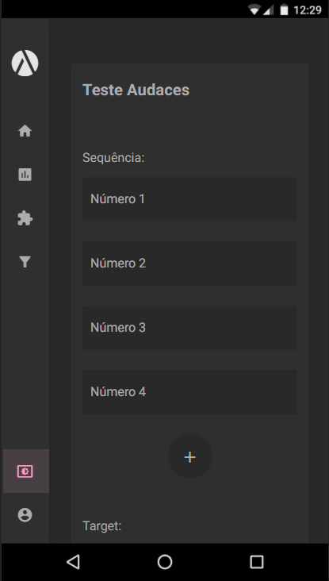

# Audaces Teste

### Aplicação desenvolvida com Angular v11.2.14


Desenvolvimento de uma aplicação que deve checar se é possível atingir o número alvo com uma combinação das pontuações e, se possível, retornar essa combinação.

Foi feito também implementação de tema dark

### DARK
<p float="left" align="center">


</p>


### LIGHT
<p float="left" align="center">


</p>

<br/>

## Iniciando o App

- Clone o repositório 
- Dentro da pasta clonada rode o commando
```
npm install
```
- finalizada a instalação rode o comando
```
ng serve 
```

## Libs Utilizadas
* [@angular/material](https://material.angular.io/)

#### DEV
* [jest](https://jestjs.io)
* [husky](https://typicode.github.io/husky/#/)
* [prettier](https://prettier.io/)
* [eslint](https://eslint.org/)
* [stylelint-prettier](https://github.com/prettier/stylelint-prettier)

* [EsLint - Plugins](#EsLintPlugins)
  * [slint-config-prettier]()
  * [eslint-plugin-import]()
  * [eslint-plugin-prettier]()
  * [eslint-plugin-security]()
  * [eslint-plugin-unused-imports]()
  * [Table](#table)
  

<br/><br/>

## Responsavel

<table>
  <tr>
    <td align="center">
      <a href="#">
        <br>
        <sub>
          <b>Erick Ferreira</b>
        </sub>
      </a>
    </td>
  </tr>
</table>

